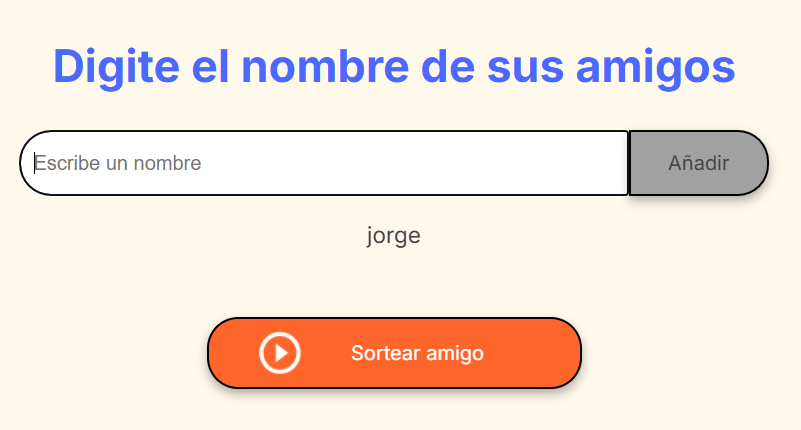

# amigo_secreto
Desafio logica y programacion Alura-Oracle

Funcionaidad
Consiste en agregar nombres de amigos que se iran mostrando en pantalla para posteriormente al sortear amigo elegir uno aleatoriamente y mostrarlo como resultado de busqueda en pantalla.
Se valida que no se agrege el mismo nombre, que el nombre tenga almenos tres caracteres, que el campo para escribir el nombre no este vacio al presionar el boton añadir, cada vez que presione el boton sortear amigo, mostrara un nombre nuevo hasta que la lista tenga nombres, de lo contrario indicara que ha terminado de sortear.

  
  

